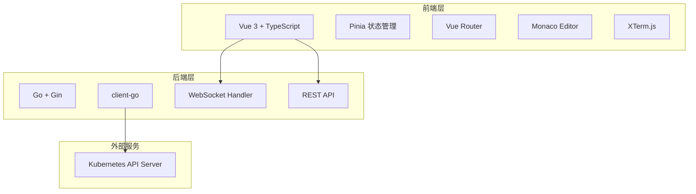
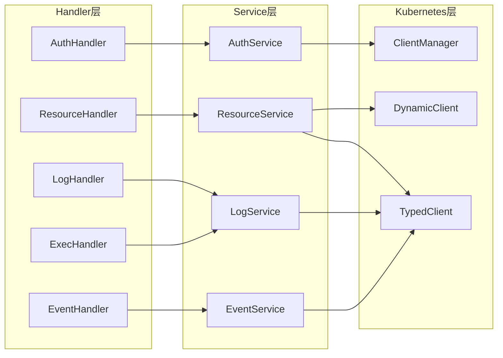
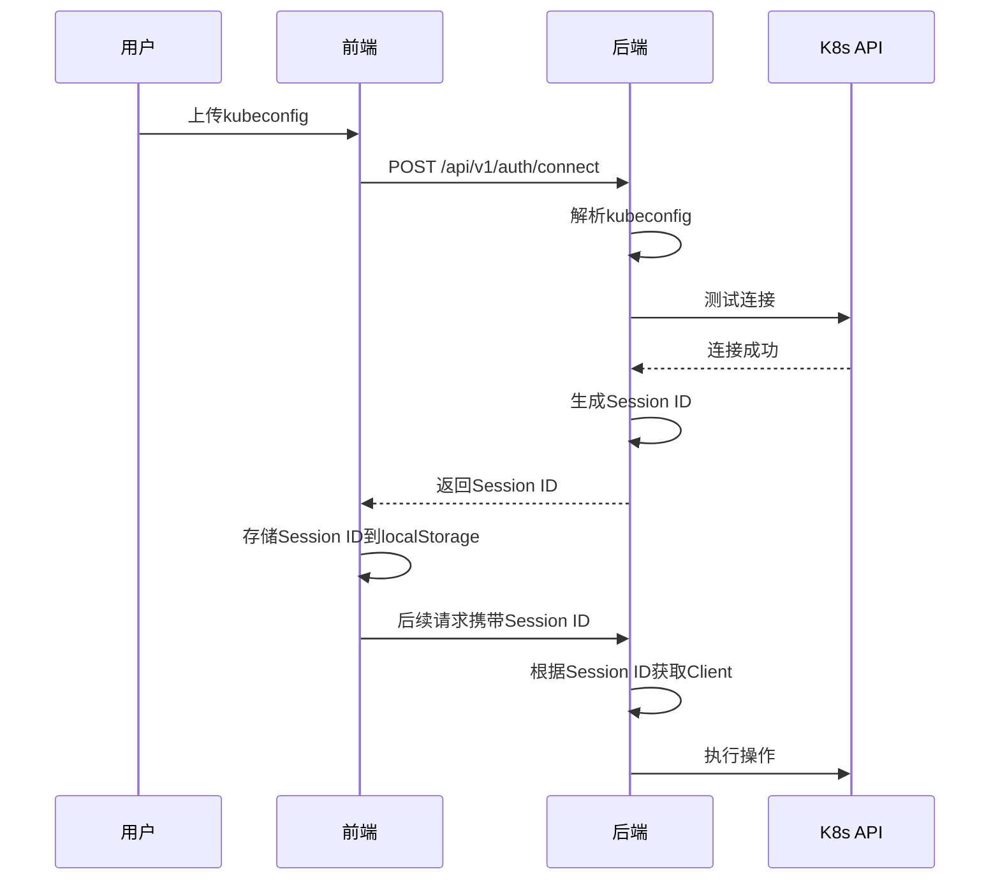
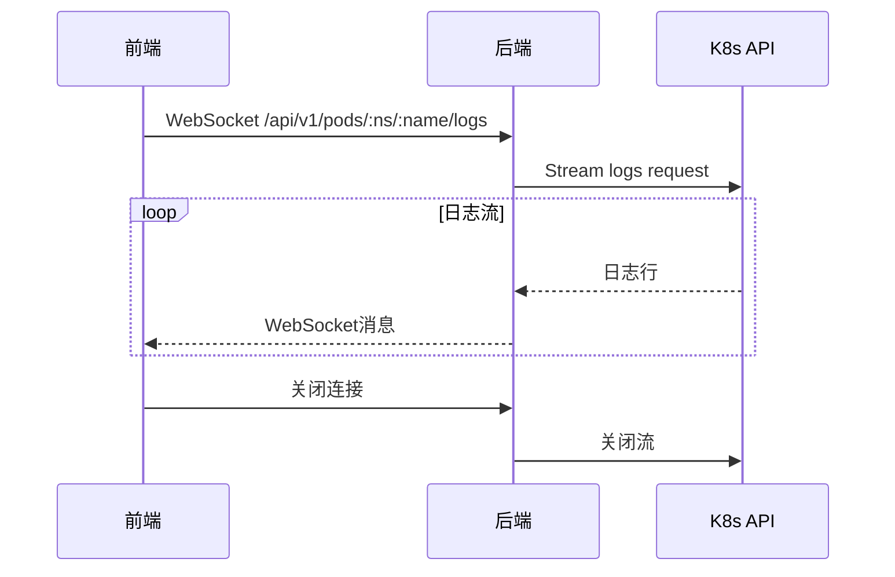
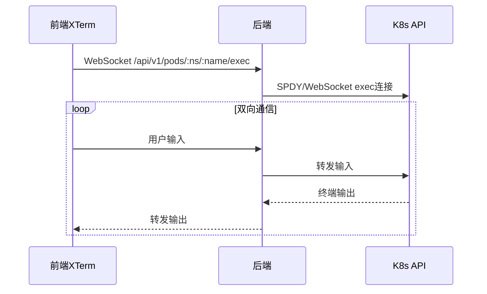

# K8s集群管理平台 - 技术架构文档

## 1. 架构设计



## 2. 技术描述

### 2.1 前端技术栈
- **框架**: Vue 3 + TypeScript + Vite
- **状态管理**: Pinia
- **路由**: Vue Router 4
- **UI组件库**: Element Plus (支持深色主题)
- **代码编辑器**: Monaco Editor (VS Code编辑器核心)
- **终端模拟**: XTerm.js + xterm-addon-fit
- **图表**: ECharts
- **HTTP客户端**: Axios
- **样式**: TailwindCSS + SCSS

### 2.2 后端技术栈
- **语言**: Go 1.21+
- **Web框架**: Gin
- **K8s客户端**: client-go (官方Go客户端)
- **WebSocket**: gorilla/websocket
- **配置管理**: Viper
- **日志**: Zap

### 2.3 部署架构
- **前端**: 静态文件，可部署在任何Web服务器
- **后端**: 独立二进制文件，通过kubeconfig连接K8s集群
- **认证**: 基于K8s原生认证，不存储凭证

## 3. 项目结构

```
k8s-dashboard/
├── frontend/                    # 前端项目
│   ├── src/
│   │   ├── api/                # API调用
│   │   ├── components/         # 公共组件
│   │   ├── views/              # 页面视图
│   │   ├── stores/             # Pinia状态
│   │   ├── router/             # 路由配置
│   │   ├── composables/        # 组合式函数
│   │   ├── types/              # TypeScript类型
│   │   └── styles/             # 样式文件
│   ├── package.json
│   └── vite.config.ts
├── backend/                     # 后端项目
│   ├── cmd/
│   │   └── server/
│   │       └── main.go         # 入口文件
│   ├── internal/
│   │   ├── handler/            # HTTP处理器
│   │   ├── service/            # 业务逻辑
│   │   ├── kubernetes/         # K8s客户端封装
│   │   └── middleware/         # 中间件
│   ├── pkg/
│   │   ├── config/             # 配置
│   │   └── response/           # 响应封装
│   ├── go.mod
│   └── go.sum
└── README.md
```

## 4. 路由定义

### 4.1 前端路由

| 路由 | 用途 |
|------|------|
| `/login` | 登录页面，配置kubeconfig |
| `/dashboard` | 仪表盘，集群概览 |
| `/resources/:kind` | 资源列表页面 |
| `/resources/:kind/:namespace/:name` | 资源详情页面 |
| `/logs` | 日志查看页面 |
| `/events` | 事件列表页面 |
| `/terminal` | 终端页面 |

### 4.2 后端API路由

| 方法 | 路由 | 用途 |
|------|------|------|
| POST | `/api/v1/auth/connect` | 验证kubeconfig并建立连接 |
| GET | `/api/v1/cluster/info` | 获取集群信息 |
| GET | `/api/v1/cluster/health` | 获取集群健康状态 |
| GET | `/api/v1/namespaces` | 获取命名空间列表 |
| GET | `/api/v1/resources/:kind` | 获取资源列表 |
| GET | `/api/v1/resources/:kind/:namespace/:name` | 获取资源详情 |
| PUT | `/api/v1/resources/:kind/:namespace/:name` | 更新资源 |
| GET | `/api/v1/resources/:kind/:namespace/:name/yaml` | 获取资源YAML |
| GET | `/api/v1/pods/:namespace/:name/logs` | 获取Pod日志 (WebSocket) |
| GET | `/api/v1/events` | 获取事件列表 |
| GET | `/api/v1/pods/:namespace/:name/exec` | Pod exec (WebSocket) |

## 5. API定义

### 5.1 通用响应格式

```typescript
interface ApiResponse<T> {
  code: number;
  message: string;
  data: T;
}

interface ResourceList<T> {
  items: T[];
  total: number;
  continueToken?: string;
}
```

### 5.2 核心类型定义

```typescript
interface ClusterInfo {
  name: string;
  version: string;
  nodeCount: number;
  namespaceCount: number;
}

interface ResourceMeta {
  name: string;
  namespace: string;
  uid: string;
  creationTimestamp: string;
  labels: Record<string, string>;
  annotations: Record<string, string>;
}

interface PodInfo {
  metadata: ResourceMeta;
  status: {
    phase: string;
    podIP: string;
    hostIP: string;
    startTime: string;
    containerStatuses: ContainerStatus[];
  };
  spec: {
    containers: Container[];
    nodeName: string;
  };
}

interface Container {
  name: string;
  image: string;
  ports?: Port[];
}

interface ContainerStatus {
  name: string;
  ready: boolean;
  restartCount: number;
  state: {
    running?: { startedAt: string };
    terminated?: { exitCode: number; reason: string };
    waiting?: { reason: string };
  };
}

interface Event {
  metadata: ResourceMeta;
  involvedObject: {
    kind: string;
    name: string;
    namespace: string;
  };
  reason: string;
  message: string;
  type: 'Normal' | 'Warning';
  count: number;
  firstTimestamp: string;
  lastTimestamp: string;
}

interface LogOptions {
  namespace: string;
  podName: string;
  containerName?: string;
  follow: boolean;
  tailLines?: number;
  sinceSeconds?: number;
  timestamps: boolean;
}

interface ExecOptions {
  namespace: string;
  podName: string;
  containerName?: string;
  command: string[];
  stdin: boolean;
  stdout: boolean;
  stderr: boolean;
  tty: boolean;
}
```

### 5.3 Diff预览请求

```typescript
interface DiffRequest {
  originalYaml: string;
  modifiedYaml: string;
}

interface DiffResponse {
  additions: number;
  deletions: number;
  changes: number;
  diffHtml: string;
}
```

## 6. 服务端架构



## 7. 认证流程



## 8. WebSocket通信

### 8.1 日志流



### 8.2 Pod Exec



## 9. 配置管理

### 9.1 后端配置 (config.yaml)

```yaml
server:
  host: 0.0.0.0
  port: 8080

session:
  timeout: 3600
  cleanup_interval: 300

log:
  level: info
  format: json
```

### 9.2 环境变量

| 变量名 | 说明 | 默认值 |
|--------|------|--------|
| `KUBECONFIG` | 默认kubeconfig路径 | `~/.kube/config` |
| `SERVER_PORT` | 服务端口 | `8080` |
| `LOG_LEVEL` | 日志级别 | `info` |

## 10. 安全考虑

1. **凭证处理**: kubeconfig仅在内存中处理，不持久化存储
2. **RBAC**: 所有操作继承kubeconfig用户的RBAC权限
3. **CORS**: 配置允许的前端域名
4. **WebSocket**: 验证Origin头
5. **输入验证**: 验证所有用户输入，防止注入攻击

## 11. 错误处理

### 11.1 错误码定义

| 错误码 | 说明 |
|--------|------|
| 0 | 成功 |
| 1001 | 认证失败 |
| 1002 | 会话过期 |
| 2001 | 资源不存在 |
| 2002 | 资源更新失败 |
| 2003 | YAML格式错误 |
| 3001 | K8s API连接失败 |
| 3002 | 权限不足 |

### 11.2 前端错误处理

- API错误: 显示Toast提示
- WebSocket断开: 自动重连机制
- 网络错误: 显示重试按钮

## 12. 性能优化

### 12.1 前端优化
- 路由懒加载
- 虚拟滚动 (大列表)
- 防抖/节流 (搜索输入)
- WebSocket心跳保活

### 12.2 后端优化
- K8s客户端连接池
- 响应缓存 (资源列表)
- 分页查询
- 并发请求处理
